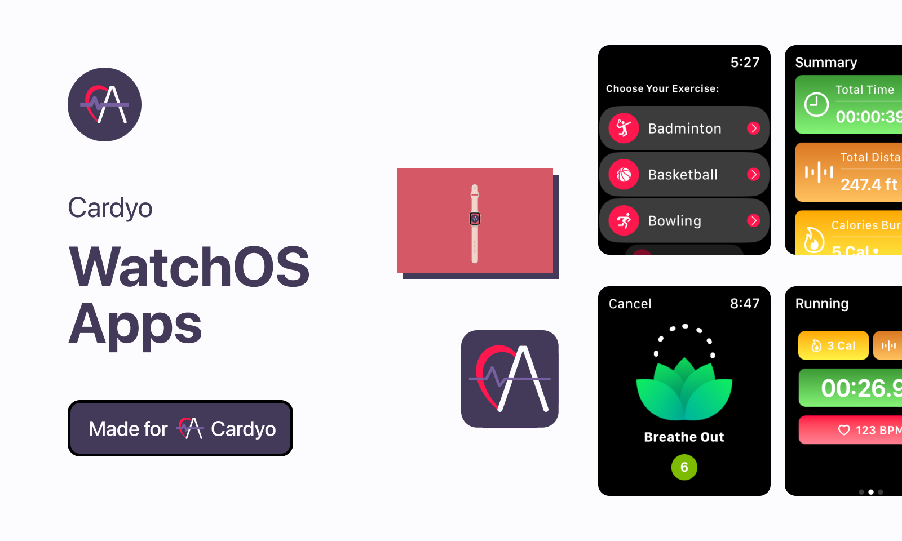
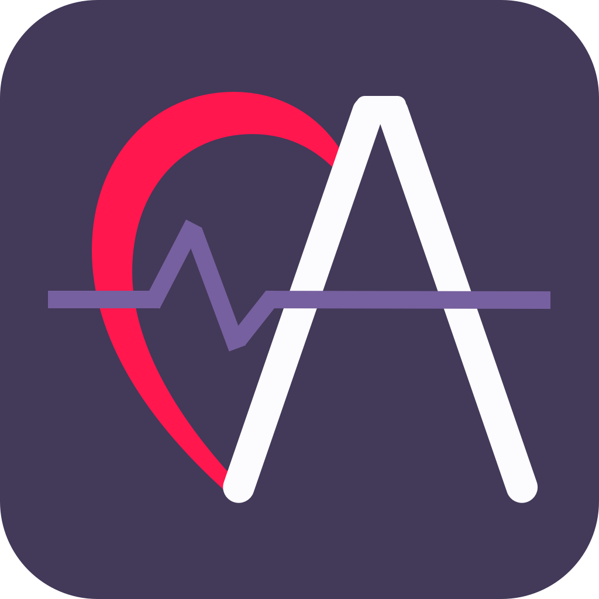

<!-- ABOUT THE PROJECT -->
<p align="center">
  <a href="#" target="_blank"></a>
</p>

<h1 align="center">
  <br>
    <a href="#" target="_blank"></a>
  <br>
  <p>Cardyo</p>
</h1>

<h4 align="center">Cardyo are made with <a href="https://developer.apple.com/swift/" target="_blank">Swift 5</a> & <a href="https://figma.com" target="_blank">Figma</a>.</h4>

<p align="center">
  <a href="#about">About</a> •
  <a href="#preview">Preview</a> •
  <a href="#installation">Installation</a> •
  <a href="#features">Features</a> •
  <a href="#license">License</a>
</p>

# About
Cardyo is a sports WatchOS application that records and calculates cardiovascular metrics. This application is designed for people who enjoy sports commonly played in Indonesia and wants to tracked their cardiovascular metrics.

### Preview
<p align="center">
  <a href="#" target="_blank"></a>
</p>

<!-- ABOUT THE FILE & FOLDER STRUCTURE -->
## Folder & File Structure
Here is the file and folder structure for 

:

    .
    ├── Assets                              # Contains Colors, Logo & Images
    ├── MyWorkouts WatchKit Extension       # Contains Cardyo Watch Apps
    ├── CardyoApp                           # Contains Cardyo Root Project
    ├── ComplicationController              # Contains Complication View When Lock Screen Mode Activated
    ├── Helper                              # Contains EnumTabView Data and Extension Activity Type
    │   ├── EnumTabViewData.swift
    │   └── ExtensionActivityType.swift                 
    │
    ├── Model                                # Contains Data & Their Type 
    │   └── SummaryMetricModel          
    │
    ├── ViewModel                            # Contains Reusable General Function
    │   ├── WorkoutViewModel.swift       
    │   ├── TimeFormatterViewModel.swift      
    │   └── MetricViewModel.swift 
    │
    └── View                                 # Contains Reusable Main Apps View
        ├── ActivityRingsView.swift
        ├── ControlsView.swift
        ├── ElapsedTimeView.swift
        ├── MetricView.swift
        ├── SessionPagingView.swift
        ├── StartView.swift
        ├── SummaryView.swift    
        ├── BreathView.swift   
        ├── RingsView.swift
        ├── SummaryPagingView.swift   
        └── EndWorkoutView.swift          

<!-- List of Features -->
# Features:

* HealthKit Integration
* Indonesian Common Sport / Exercise / Workout
* HealthKit Cardyo Metrics (Calories Burned, Running Walking Distance, and Heart Rate)
* Activity Rings
* WatchOS App & Extension
* Workout Notifications (Daily Workout Reminder at 07.00 A.M.)
* 60 Seconds Resting / Breathing Animation
* Pulse Animation for Breathing Flower
* Controls View for Pause and Stop Exercising
* Local Files Music Integration
* Core Animation With Anchor
* Reusable Components
* All Stacks (HStack, VStack, ZStack)
* User Notifications Permission
* HealthKit Permission for Read and Write Data
* Complication for Watch Lock Screen Mode
* Session Get and Fetch Data

<!-- Used Tools -->
## Build With

* [Swift](https://www.swift.org/documentation/)
* [SwiftUI](https://developer.apple.com/documentation/swiftui/)
* [Xcode](https://developer.apple.com/xcode/)
* [Figma](https://www.figma.com/file/odx5dhDAoX1v7au5cjEaEv/Cardyo%3A-A-Native-WatchOS-Sports-App?type=design&node-id=0%3A1&t=VZXdMFKWXjKhfL9f-1)

<!-- How to Install -->
# Installation
To use this repository, please follow the usage instructions below and make sure that Git is installed on your computer (execute all commands in cmd.exe or terminal):

1. Download the .zip file or clone the repository using the following command:
```bash
git clone https://github.com/dekapd99/Cardyo.git
```

2. Once the project is downloaded or cloned, open the project in Xcode by clicking on "Open a Project or File".

3. Make sure to select Apple Watch as the target simulator (Device column at the top of Xcode).

4. Build and Run the project.

<!-- What Kind of License? -->
# License
MIT License: Copyright (c) 2022

DISCLAIMER: ASSETS ARE USED FOR EDUCATION PURPOSE ONLY, NOT FOR COMMERCIAL PURPOSES

Assets Source: [SF Symbols 4 Icon](https://developer.apple.com/sf-symbols/)

Figma Projects: [Cardyo Figma](https://www.figma.com/file/odx5dhDAoX1v7au5cjEaEv/Cardyo%3A-A-Native-WatchOS-Sports-App?type=design&node-id=0%3A1&t=VZXdMFKWXjKhfL9f-1)

Medium Article: [Cardyo Medium](https://medium.com/@dekaprimatio/cardyo-a-native-watchos-sports-apps-️-️-c1848a0bbba5)

<p align="right">(<a href="#about">back to top</a>)</p>
